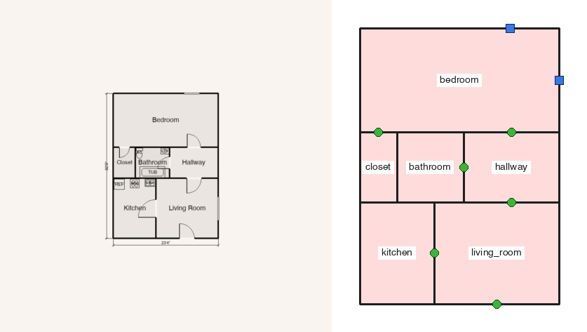
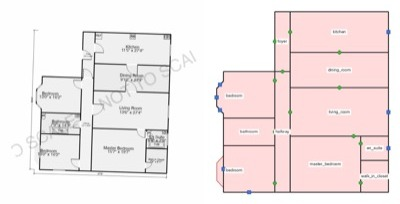

# ArchbuildAI

**Turn a 2D floor plan image into an editable 3D model inside Blender.**

Drop in a listing floor plan, a CAD export or a scan, press *Generate*, and get walls,
door and window openings, floors, ceilings and correctly named rooms as ordinary Blender
objects you can edit, render, or export. Everything runs locally on your machine.
Optional "Premium" features (furniture placement, exterior generation, layout critique,
natural-language edits) use the Claude API with your own key.

Floor plan in, parsed walls, doors, windows and named rooms out:





## How it works

ArchbuildAI is a hybrid of two local models, chosen because each is good at exactly one half of the job:

1. **Geometry — YOLO.** A detector and segmenter trained on annotated floor plans find the walls,
   doors, windows and room polygons. A post-pass clips walls to the building footprint (dimension
   lines and balcony hatching otherwise become stray walls), drops sliver polygons, and closes any
   open stretch of the outline, so the outside shape matches the plan.
2. **Reading — Qwen2.5-VL.** A 7B vision-language model reads the text printed on the plan:
   every room name, with its position, is snapped onto the room polygon that contains it, and
   every dimension string (`17'9"`, `4.20`) is used to work out the plan's true scale, so the
   model comes out at real-world size without you measuring anything.

The two halves talk through one JSON schema, and the Blender side builds meshes from that JSON.
On Apple Silicon the reading model runs on MLX; elsewhere it runs on PyTorch.

## Install

Requirements: Blender 4.2 or newer, roughly 16 GB of RAM or VRAM for the reading model, and
internet for the first-run downloads. Tested on macOS Apple Silicon with Blender 5.1.

1. Download `archbuildai-<version>.zip` from the [latest release](https://github.com/nathanclearman/archbuildai/releases/latest).
2. In Blender: **Edit › Preferences › Get Extensions › ⌄ › Install from Disk**, pick the zip.
3. Open **Preferences › Add-ons › ArchbuildAI** and click, in order:
   *Install geometry packages*, *Install VLM packages*, *Download base model*.
   The panel shows what is still missing. Packages go into Blender's own Python (user
   site-packages) and the model into the Hugging Face cache; the Blender app itself is untouched.
4. In the 3D Viewport press **N** and open the **ArchbuildAI** tab.

## Use

1. Pick the floor plan image.
2. Leave **Auto** scale on. The printed dimensions set the scale; the *Scale Factor* field is
   only the starting guess and is used as-is when Auto is off or a plan carries no dimensions.
3. Model: **Hybrid** (default). Press **Generate 3D Model**. With *Review Before 3D* enabled you
   get a 2D correction pass first, where you can move wall endpoints and add or delete doors and
   windows before the mesh is built.
4. Adjust wall height, add ceilings, stack stories, or export to FBX / OBJ / glTF from the side panel.

Backends in the *Model* dropdown:

| Backend | What it does | Needs |
|---|---|---|
| Hybrid | YOLO geometry + Qwen room names + auto scale | geometry packages, VLM packages, base model |
| YOLO only | Geometry with heuristic room names | geometry packages |
| Qwen2.5-VL (trained) | A fine-tuned adapter end to end (experimental; slow, layout quality limited) | VLM packages, base model, adapter folder set in preferences |
| Premium Vision | Claude reads the plan | Claude API key |

Typical timings on an M4 Max: geometry in about 5 seconds, room names in about 30 seconds,
the dimension pass 2 to 5 minutes depending on how many dimension strings the plan carries
(turn *Auto* off to skip it).

## Repository layout

```
floorplan3d/blender_addon/   the Blender extension (UI, geometry, correction mode, api/ clients)
floorplan3d/model/           Qwen2.5-VL runtime and training pipeline (inference.py is bundled into the zip)
floorplan3d/tests/           pytest suite (+ a real-Blender geometry test)
floorplan3d/package.py       builds the extension zip
docs/                        example images
```

Development: `pip install -r floorplan3d/model/requirements.txt`, then
`python -m pytest floorplan3d/tests`. Build a release zip with
`python floorplan3d/package.py --with-weights`. See `floorplan3d/README.md` for the add-on
details and troubleshooting.

## Limitations

- Rectilinear plans work best. Curved walls and angled wings are not handled.
- Room polygons inside dense bathroom clusters can come out fragmented; those get a generic
  `room` label rather than a wrong guess.
- Hand-drawn plans are hit and miss.
- Windows and Linux code paths exist but have not been tested.

## License

ArchbuildAI's own code is **MIT**. Third-party pieces: Qwen2.5-VL (Apache-2.0), mlx-vlm (MIT),
Ultralytics YOLO (AGPL-3.0 — a distributed build that imports it must be open source under AGPL
terms), and the bundled YOLO weights, trained on CubiCasa5k (CC BY-NC-SA 4.0, non-commercial).
Replacing the YOLO backend is the path to a fully unencumbered build.
